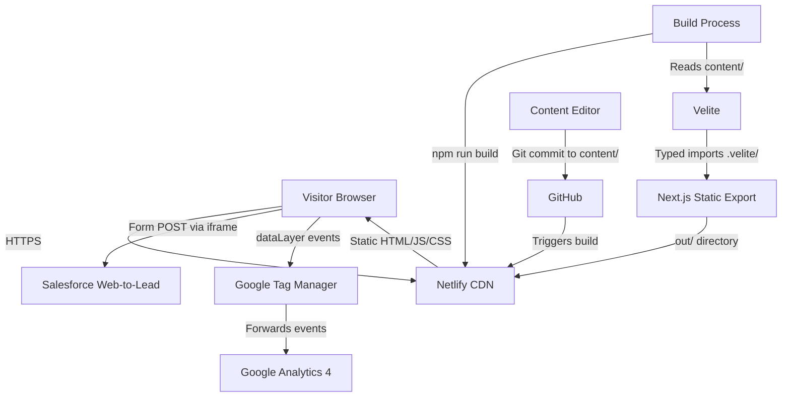
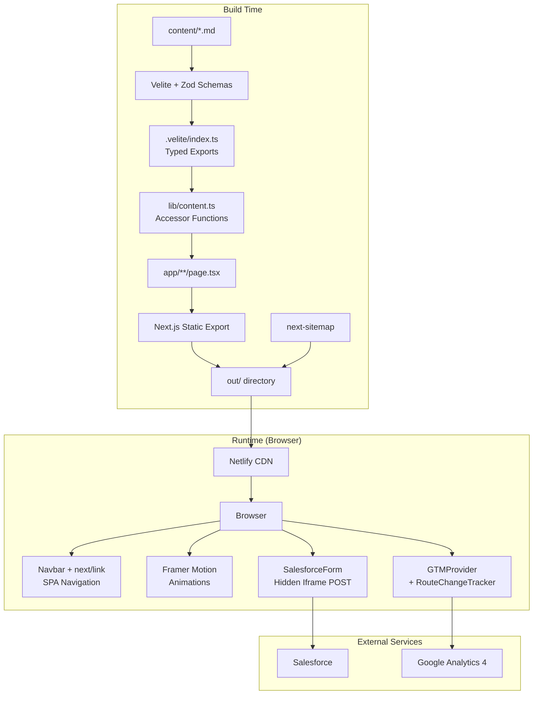
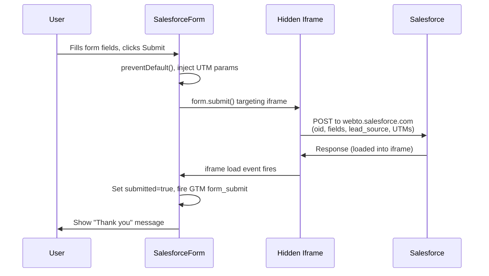

# OpsChain Website — Architecture

## 1. Overview

The OpsChain website is a statically-generated marketing site for the OpsChain enterprise operations automation platform. It serves product information, blog content, gated datasheets, webinar listings, and lead capture forms to enterprise buyers across utilities, banking, and telecommunications.

The site is built with Next.js 15 (App Router, `output: 'export'`), TypeScript, Tailwind CSS v4, Velite for content processing, and Framer Motion for animations. It deploys as a static SPA to Netlify. Lead capture submits directly to Salesforce Web-to-Lead. Analytics are handled by Google Tag Manager with client-side dataLayer events.

There is no backend server, no database, and no runtime API. All content is processed at build time from Markdown files in the repository.

## 2. System Context Diagram



## 3. Component / Module Structure

```
app/                            # Next.js App Router — all page routes
  layout.tsx                    # Root layout: fonts, metadata, Navbar, Footer, GTM, RouteChangeTracker
  page.tsx                      # Homepage: Hero, StatBar, FeatureGrid, ProductTour, Verticals, etc.
  globals.css                   # Tailwind imports, design tokens (@theme), prose styles
  blog/                         # /blog/ index + /blog/[slug]/ dynamic posts
  features/                     # 7 feature pages (autonomous-agents, governed-intelligence, etc.)
  solutions/                    # 3 vertical landing pages (utilities-energy, banking-finance, telecommunications)
  resources/                    # Datasheet index + /resources/[slug]/ gated downloads
  webinars/                     # Webinar index + /webinars/[slug]/ detail pages
  our-approach/                 # Positioning page
  book-demo/                    # Demo request form page
  privacy/, terms-of-use/, eula/ # Legal pages

components/
  ui/Navbar.tsx                 # Sticky header, transparent→solid on scroll, animated dropdowns
  ui/Footer.tsx                 # 5-column footer with external/internal links
  ui/FeaturePageLayout.tsx      # Reusable template for feature pages
  forms/SalesforceForm.tsx      # Base form: hidden iframe POST to Salesforce, UTM injection, GTM events
  forms/ContactForm.tsx         # Contact form (extends SalesforceForm)
  forms/DemoRequestForm.tsx     # Demo booking form (extends SalesforceForm)
  forms/GatedAssetForm.tsx      # Gated download form with unlock state
  analytics/GTMProvider.tsx     # GTM container script injection
  analytics/RouteChangeTracker.tsx  # Fires page_view on SPA route change
  analytics/ScrollTracker.tsx   # Fires scroll_depth events at 25/50/75/100%
  analytics/CTAButton.tsx       # Link/button that fires cta_click GTM event
  seo/JsonLd.tsx                # JSON-LD schema components (Organization, BlogPosting, Event, FAQ)
  Hero.tsx                      # Homepage hero with word-by-word stagger animation
  StatBar.tsx                   # Animated number counters (scroll-triggered)
  ProductTour.tsx               # Tabbed product walkthrough with AnimatePresence
  ComparisonTable.tsx           # OpsChain vs 4 competitors, sticky column, animated rows
  SocialProof.tsx               # Logo marquee + testimonial
  CTABanner.tsx                 # Full-width conversion banner
  VerticalCard.tsx              # Industry card with compliance tags and hover animation
  CountdownTimer.tsx            # Live countdown for upcoming webinars
  PageTransition.tsx            # Page enter/exit animation wrapper
  AnimatedSection.tsx           # Scroll-reveal wrapper with configurable direction

content/                        # Markdown content (source of truth)
  blog/                         # 20 blog posts
  datasheets/                   # 5 gated datasheets
  webinars/                     # 3 webinars (upcoming, past, on-demand)

lib/
  content.ts                    # Typed accessors wrapping Velite imports (getAllBlogPosts, etc.)
  utm.ts                        # UTM parameter capture/retrieval via sessionStorage

public/
  img/                          # ~70 static images (logos, icons, screenshots, blog images)
  llms.txt                      # LLM discoverability file per llmstxt.org

velite.config.ts                # Content schema definitions (Zod-validated)
next.config.ts                  # Next.js config + Velite webpack plugin
netlify.toml                    # Build config + SPA catch-all redirect
next-sitemap.config.js          # Sitemap + robots.txt generation
```

## 4. Architecture Diagram



## 5. Data Flow

### Content Pipeline (Build Time)

1. Author creates/edits a Markdown file in `content/blog/`, `content/datasheets/`, or `content/webinars/` with YAML frontmatter
2. On `npm run build`, the Velite webpack plugin processes all content files
3. Velite validates frontmatter against Zod schemas defined in `velite.config.ts`
4. Valid content is output as typed TypeScript in `.velite/index.ts` (arrays of `Post`, `Datasheet`, `Webinar`)
5. `lib/content.ts` imports from `.velite/` and provides accessor functions (filtering, sorting, related posts)
6. Page components call these accessors at build time to generate static HTML
7. `generateStaticParams()` in dynamic routes (`[slug]/page.tsx`) produces one HTML file per content item
8. `next-sitemap` runs in `postbuild` to generate `sitemap.xml` and `robots.txt` into `out/`

### Form Submission (Runtime)



### SPA Navigation (Runtime)

1. User clicks an internal link (`next/link`)
2. Next.js client-side router fetches the target page's JS chunk (prefetched)
3. `PageTransition` animates the outgoing page (fade out) and incoming page (fade + slide up)
4. `RouteChangeTracker` detects pathname change via `usePathname()`, pushes `page_view` to `window.dataLayer`
5. GTM picks up the event and forwards to GA4

## 6. Configuration & Environment

| Variable | Purpose | Required | Default |
|---|---|---|---|
| `NEXT_PUBLIC_SF_ORG_ID` | Salesforce org ID for Web-to-Lead forms | Production | `00DQE00000BdTqD` |
| `NEXT_PUBLIC_GTM_ID` | Google Tag Manager container ID | Production | None (GTM disabled if unset) |
| `NEXT_PUBLIC_SITE_URL` | Canonical site URL for metadata and sitemap | Production | `https://opschain.io` |

No secrets are required at build or runtime. The Salesforce org ID is not sensitive — it's embedded in the public HTML form. GTM ID is public by design.

Configuration files:
- `next.config.ts` — Build mode (`output: 'export'`), trailing slashes, image config, Velite webpack plugin
- `velite.config.ts` — Content collection schemas (Zod), output paths
- `next-sitemap.config.js` — Sitemap URL, robots.txt policies, output directory
- `netlify.toml` — Build command, publish directory, SPA redirect
- `tailwind.config.ts` — Design tokens (colors, fonts, spacing)
- `tsconfig.json` — Strict mode, path aliases (`@/*`, `@/.velite`)

## 7. External Integrations

### Salesforce Web-to-Lead

- **Protocol:** HTML form POST (via hidden iframe, not fetch)
- **Endpoint:** `https://webto.salesforce.com/servlet/servlet.WebToLead?encoding=UTF-8`
- **Auth:** Org ID (`oid` field) — no API key or OAuth
- **Fields sent:** `oid`, `first_name`, `last_name`, `email`, `company`, `title`, `phone`, `description`, `lead_source`, `retURL`, UTM parameters
- **Error handling:** Salesforce returns a page into the iframe. Cross-origin prevents reading the response, so a 3-second timeout fallback assumes success. Salesforce sends rejection emails to the configured debug address if a submission fails (e.g. duplicate detection rules).

### Google Tag Manager / GA4

- **Protocol:** JavaScript (GTM container script)
- **Auth:** Container ID (`NEXT_PUBLIC_GTM_ID`) — public
- **Events pushed to dataLayer:**
  - `page_view` — on every SPA route change (RouteChangeTracker)
  - `form_submit` — on Salesforce form submission (`form_name`, `page_path`)
  - `cta_click` — on CTA button clicks (`cta_label`, `page_path`)
  - `scroll_depth` — at 25/50/75/100% thresholds (`percent_scrolled`, `page_path`)
  - `asset_download_unlock` — when a gated asset form is submitted (`asset_name`, `page_path`)

### Google Fonts

- **Fonts:** Poppins (headings), Rubik (body)
- **Loaded via:** `next/font/google` — self-hosted at build time, no runtime requests to Google

## 8. Deployment & Runtime

### Build

```bash
npm run build     # 1. Velite processes content/ → .velite/
                  # 2. Next.js compiles pages → out/
                  # 3. next-sitemap generates sitemap.xml + robots.txt → out/
```

Produces a fully static `out/` directory (~50 HTML files + JS chunks + images).

### Deploy

Netlify watches the GitHub branch. On push:
1. Runs `npm run build`
2. Deploys `out/` to CDN edge nodes
3. The `[[redirects]]` rule (`/* → /index.html`) enables SPA deep linking — any URL resolves to the app shell, then the client-side router renders the correct page

### Runtime

- No server process. All pages served as static files from CDN.
- JavaScript hydrates on load, enabling SPA navigation, animations, and form submissions.
- No cold starts, no scaling concerns, no server costs.

## 9. Testing

No automated test suite exists currently. The project relies on:

- **TypeScript strict mode** — catches type errors at build time
- **Velite Zod schemas** — validates content frontmatter at build time (build fails on invalid content)
- **ESLint** (`npm run lint`) — catches common React/Next.js issues
- **Prettier** (pre-commit hook) — enforces formatting consistency
- **Build verification** — `npm run build` must pass cleanly (zero errors, all pages generated)

### Known testing gaps

- No unit tests for components
- No integration tests for form submission flow
- No visual regression tests
- No accessibility automated tests (Lighthouse manual only)
- No end-to-end tests for SPA navigation

## 10. Known Limitations & Technical Debt

- **No automated tests** — the project has zero test coverage. Priority addition would be Playwright for critical paths (form submission, SPA navigation, blog rendering).
- **Salesforce form error handling is opaque** — the hidden iframe approach means we cannot read Salesforce's response. Submission failures (duplicate rules, validation errors) are only visible via Salesforce debug emails, not to the user.
- **Blog markdown rendering** — Velite's `s.markdown()` handles conversion, but complex MDX features (custom components, interactive elements) are not supported. If needed, migrate to `next-mdx-remote`.
- **Placeholder content** — several components contain `// TODO:` markers for content that needs real copy: StatBar metrics, ProductTour screenshots, SocialProof logos/testimonials, ComparisonTable competitive claims.
- **No image optimization** — `images.unoptimized: true` is required for static export. All images are served at their original size. Consider adding a build-time image optimization step (e.g. `sharp`) if page weight becomes an issue.
- **OG image** — `og-default.png` is referenced in metadata but does not exist in `public/img/`. A 1200x630 design asset needs to be created.
- **Husky deprecation warning** — the `.husky/pre-commit` file uses the deprecated v9 format. Update to v10 syntax when upgrading.

## 11. ADR Index

| ADR | Title | Status |
|---|---|---|
| [0001](./docs/adr/0001-nextjs-static-export.md) | Next.js with static export over Docusaurus | Accepted |
| [0002](./docs/adr/0002-velite-content-processing.md) | Velite for build-time content processing | Accepted |
| [0003](./docs/adr/0003-framer-motion-animations.md) | Framer Motion for SPA animations | Accepted |
| [0004](./docs/adr/0004-salesforce-web-to-lead-iframe.md) | Salesforce Web-to-Lead via hidden iframe | Accepted |
| [0005](./docs/adr/0005-tailwind-css-v4.md) | Tailwind CSS v4 with PostCSS | Accepted |
| [0006](./docs/adr/0006-gtm-spa-tracking.md) | GTM with client-side SPA route tracking | Accepted |
| [0007](./docs/adr/0007-static-hosting-netlify.md) | Static hosting on Netlify with SPA redirect | Accepted |
