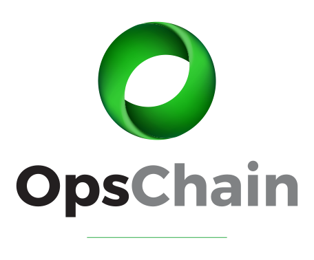

<section id='top'></section>

<header class='main-header'>
  

    
    
<button class='material-icons' data-role='mobile-menu-button'>menu</button>

  

  <nav data-role='main-nav'>
    <ul>
      <li><a href='{{ "/" | relative_url }}'>Home</a></li>
      <li><a href='#top'>Why OpsChain?</a></li>
    </ul>
    

  </nav>
</header>

  

    
  

  <main style='padding: 0 1rem'>

# Why OpsChain?

OpsChain is an orchestration and change automation platform based in GitOps principles with a core objective to **unify change**. Connect, automate, and orchestrate people, processes, and tools across your on-premise and cloud platforms.

## Change is HARD and COMPLEX

The move towards distributed systems and microservices requires a different approach for how change is managed across organisations.

Advancements in modern technologies - such as cloud and containerisation platforms, microservice-based modern applications, and agile operational processes - are impacting the way organisation deliver and manage change:

- Reducing application and platform complexity by adopting modern cloud and containerisation technologies and platforms such as Kubernetes
- Establishing DevOps and agile teams to deliver small, discreet, and frequent changes
- Implementing CI/CD pipelines and automation to underpin their change delivery
- Adopting Git-centric methodologies to streamline and improve overall delivery pipelines

_**... all with the objective to simplify change!**_

The move from large-scale monolithic systems to distributed microservice-based systems has resulted in an exponential increase in the volume of changes required to run and operate an organisation's core systems and platforms.

Organisations are adopting modern technologies and platforms with the objective of simplifying their change and lowering their costs.

However, like most things in modern enterprises, nothing is ever that simple.

- In enterprise, changes are NOT entirely discreet and are often highly inter-dependent, cutting across team boundaries
- Changes are still required across legacy platforms and are bound to legacy processes for delivery
- Modern technology, such as Kubernetes and containerisation platforms aim to simplify their operational management, but not everything is container-ready
- Automation is a keystone requirement - but not everything is automated, nor automation-friendly - so it is put in the "too-hard basket"
- Change process still relies on older monolithic technologies such as Jenkins and Bamboo, resulting in a patchwork quilt of technologies "stitched together" in order to meet requirements

Compromise on the above items often leads to higher average cost per change and higher overall cost of change!

[OpsChain](https://opschain.io) was developed to address the problem of managing change in a consistent and uniform way across on-premise, cloud, modern, and legacy platforms. Our objective is to unify people, process, and technology in order to simplify and reduce the operational complexities and costs of running and operating modern enterprise applications and systems in today's world.

## What is OpsChain?

OpsChain unifies your ability to deliver change by bringing all your existing tools, people, and processes together in a single **GitOps**-based workflow — providing a single place to track change and configuration across your platforms and environments.

### Simplify and unify change across all your environments and tools

- Zero-touch change from development to production
- Track state and how it changes across each deployment and environment
- Connect the best tools for each job with one universal view of state
- Robust orchestration engine that can handle simple or complex changes
- Reduce your overall cost of change

### Observability and control

- Track and audit change across your entire portfolio regardless of the underlying tool-chain used
- Centralised log aggregation across your tool chains included out of the box
- Ship change logs to a permanent store of choice
- See who changed which environment and what they changed
- See detailed records of each change deployment
- Feed all change and event data into your analysis tools via the API

### Cloud-native microservice-based platform

OpsChain is built with a modern microservices architecture and cloud-native technologies

- container-ready platform
- easy to install, easy to upgrade
- can be easily scaled across single or multiple nodes
- deploy on-premise, in the cloud or behind a firewall

### Pluggable platform

OpsChain is a complete pluggable platform and aims at providing a frictionless platform for delivering change using your tools the way you want, whilst delivering unified view of state of change across your portfolio.

Use the tools you want to deliver the changes the way you want them.
Plugins out of the box for common tools such as [Terraform](https://www.terraform.io), [Kubernetes](https://kubernetes.io), and [Ansible](https://www.ansible.com), and common cloud platforms such as [AWS](https://aws.amazon.com), [Azure](https://azure.microsoft.com/en-au), and [GCP](https://cloud.google.com).

OpsChain plugins are lightweight and leverage native SDKs provided by each of the vendors.

_**No plugins available for your tools? No problem!**_

Simply add your own OpsChain plugin and wrap your own tools in a way that makes sense for you.

### API-first

OpsChain is an API-first platform. APIs are available for all core capabilities provided by the platform, providing the ability to easily integrate OpsChain into your overall ecosystem.

A powerful command-line interface (CLI) is available to interact with the OpsChain platform to manage your changes, environments, and projects.

## Want to learn more?

Want to learn more about OpsChain? Please send an [OpsChain information request](mailto:opschain@limepoint.com?subject=OpsChain%20Want%20to%20learn%20more).

Interested in getting access? To request an invitation, please [fill in our trial access form]({{ "/#get-access" | relative_url }}).

  </main>

